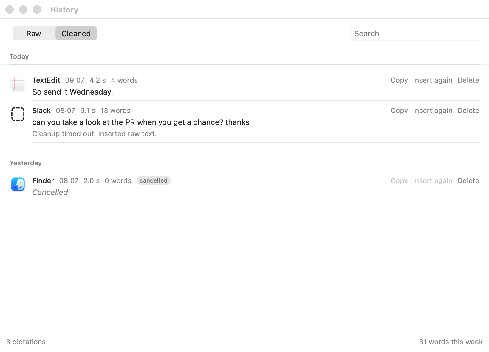
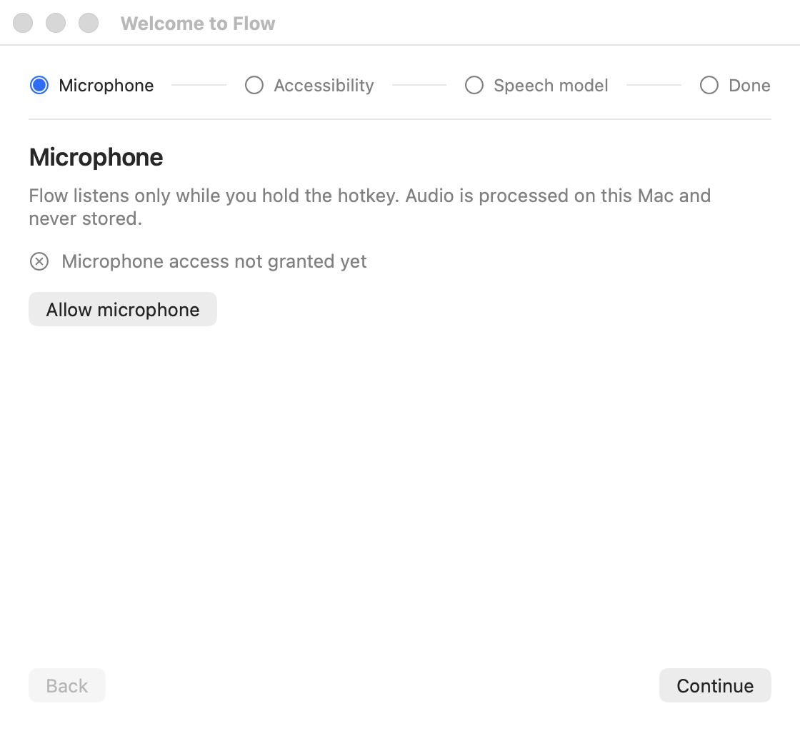
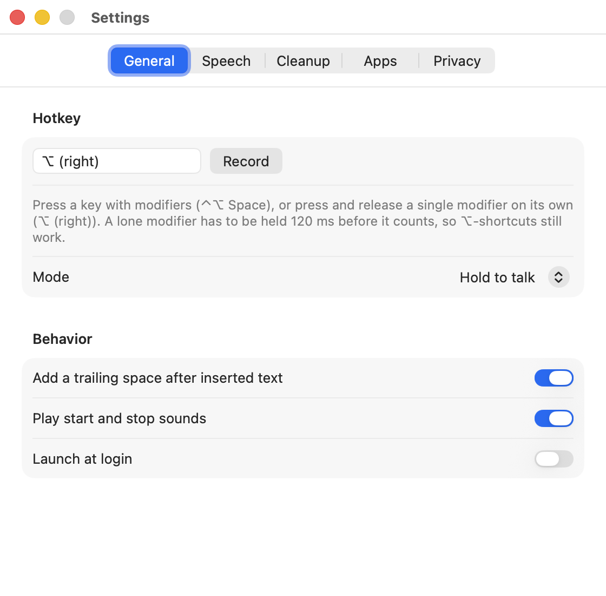

# Flow

An open-source, fully local [Wispr Flow](https://wisprflow.ai) clone for macOS: hold a hotkey, talk, release, and cleaned-up text lands at the caret of whatever app has focus. Unlike Wispr Flow, everything runs on your Mac. No account, no cloud, no subscription. The only network request the app ever makes is a one-time model download on first run.

> Built in one shot with [Build Your Own Software](https://buildyourown.software/like/wisprflow) — the entire app was vibecoded from a single prompt.

- Speech to text: NVIDIA Parakeet TDT 0.6B v3 on CoreML through [FluidAudio](https://github.com/FluidInference/FluidAudio).
- Cleanup: Apple's on-device Foundation Model on macOS 26 with Apple Intelligence on; Ollama on `127.0.0.1` when it isn't; a rule-based cleaner when neither is there.
- No API keys, no accounts, no Keychain, no cloud calls, no telemetry. The only network request the app ever makes is the one-time model download on first run.
- History with a Raw | Cleaned toggle, a dictionary, snippets, per-app tone.

## Screenshots

The dictation HUD, at the top of the screen so it never covers the caret:


History, with the Raw | Cleaned toggle:



Onboarding and Settings:




## Requirements

- An Apple Silicon Mac. Parakeet on CoreML uses the Neural Engine; Intel Macs are too slow for the once-a-second interim pass.
- macOS 15 or newer. macOS 26 if you want the Apple Foundation Model as the cleaner; on macOS 15 the Ollama path is the default.
- Xcode from the App Store (free). CoreML, the CoreML compiler, and the macOS 26 SDK with the Foundation Models framework ship with it; the Command Line Tools alone don't include them. You never have to open the Xcode GUI. Run `sudo xcode-select -s /Applications/Xcode.app` once; everything after that is `swift build` from the terminal.
- Ollama (`brew install ollama`) is optional. It's only needed on macOS 15, or on macOS 26 with Apple Intelligence off.

### A note on toolchains

The Apple cleaner needs the macOS 26 SDK. The Makefile picks a toolchain in this order:

1. `/Library/Developer/CommandLineTools` when it carries a `MacOSX26*.sdk` (that's what this repo was built with: Command Line Tools with Swift 6.3 and the 26.5 SDK, next to Xcode 16.4).
2. Otherwise whatever `xcode-select -p` points at.

Command Line Tools ship no XCTest, so `make test` borrows XCTest and the `xctest` runner from `/Applications/Xcode*.app`. If you have Xcode 26 selected, none of this matters and plain `swift build` / `swift test` work. `AppleCleaner.swift` is behind `#if canImport(FoundationModels)`, so the package still builds with an older SDK; the Apple backend then reports "Needs macOS 26 with Apple Intelligence on".

SwiftPM itself fetches dependencies (GRDB, FluidAudio, and FluidAudio's prebuilt text-normalization xcframework) at build time. That's build-time network, not app network.

## Build and run

```sh
make build          # swift build -c release
make bundle         # build/Flow.app: binary, Info.plist, icon, sounds, signature
make run            # bundle, then open build/Flow.app
make test           # FlowCore and Flow tests (the Parakeet tests skip until the model is installed)
make check-windows  # opens every window, prints sizes, screenshots to build/windows/, exits 1 on any miss
```

There are no prebuilt binaries. Build it yourself with `make run`; the first launch walks you through permissions and the model download. (Distributing a ready-to-run `.app` would need Apple Developer ID signing and notarization, which this project doesn't do.)

Layout:

```
Sources/Flow/       AppKit: status item, overlay panel, event tap, AX inserter, audio engine, windows, Apple cleaner
Sources/FlowCore/   Everything else, no AppKit: pipeline, prompts, cleaners, transcriber, audio DSP, model download, GRDB store
Tests/              FlowCoreTests (fakes for every protocol) and FlowTests
fixtures/           hello_world.wav, silence.wav, parakeet/hello_world.json, transcripts/ with expected output
scripts/            bundle.sh, make_signing_cert.sh
```

## First launch

The onboarding window walks through three things. Each one can be redone later from the menu ("Check permissions…").

1. **Microphone.** Standard prompt.
2. **Accessibility.** Needed for the global hotkey (a CGEvent tap) and for putting text at the caret. The checkmark flips within a second of granting it in System Settings; no restart.
3. **Speech model.** "Download" fetches Parakeet TDT 0.6B v3 and the Silero VAD model (about 460 MB) from Hugging Face into `~/Library/Application Support/Flow/models/parakeet-tdt-0.6b-v3/`, writes `manifest.json` with per-file SHA-256 hashes, and stores the combined checksum. That download is the only time the app uses the network.

### Offline Macs: "Load from folder…"

On a machine with internet, copy the model folder from a Mac that already has it (the whole `parakeet-tdt-0.6b-v3` directory, which contains `parakeet-tdt-0.6b-v3-coreml/` and `silero-vad-coreml/`), or assemble it by hand from Hugging Face:

```
parakeet-tdt-0.6b-v3/
  parakeet-tdt-0.6b-v3-coreml/   Preprocessor.mlmodelc  Encoder.mlmodelc  Decoder.mlmodelc  JointDecisionv3.mlmodelc  parakeet_vocab.json
  silero-vad-coreml/             silero-vad-unified-256ms-v6.2.1.mlmodelc
```

from `https://huggingface.co/FluidInference/parakeet-tdt-0.6b-v3-coreml` and `https://huggingface.co/FluidInference/silero-vad-coreml`. Then Onboarding or Settings → Speech → "Load from folder…" copies it into place, validates the file list, and computes the same checksum the downloader would. Settings → Speech shows the checksum; it matches `manifest.json`, and a copy of the same folder produces the same value.

FluidAudio never downloads anything on its own: the app forces its offline mode and loads the CoreML packages straight from the folder above.

## Permissions: grant and reset

The bundle id is `com.yourname.flow`; macOS ties both grants to it. It's a placeholder used consistently across `scripts/bundle.sh`, the log subsystem, and the settings domain. If you fork this, change `com.yourname.flow` to your own reverse-DNS id in `scripts/bundle.sh` (and, if you like, in `Sources/FlowCore/Log.swift`) so your build doesn't share TCC grants or logs with anyone else's.

```sh
tccutil reset Accessibility com.yourname.flow
tccutil reset Microphone com.yourname.flow
```

### The rebuild trap

An ad hoc signature's designated requirement is the code hash, so every rebuild is a different app to TCC. macOS silently drops the Accessibility grant, the toggle in System Settings still shows Flow as on, `AXIsProcessTrusted()` returns false, and the event tap can't be created. Neither relaunching nor clicking the toggle again fixes it; only turning it off and on, or `tccutil reset Accessibility com.yourname.flow`.

Fix it once:

```sh
scripts/make_signing_cert.sh   # creates a self-signed "Flow Dev" code signing identity in the login keychain
make run
```

`bundle.sh` signs with "Flow Dev" whenever `security find-identity -v -p codesigning` lists it, and falls back to ad hoc with a warning otherwise. The app also polls `AXIsProcessTrusted()` once a second and installs the tap the moment it flips to true, and onboarding says in plain words when a previously trusted build lost its grant.

## Cleanup backends

- **Apple** (macOS 26, Apple Intelligence on): one `LanguageModelSession` per dictation, temperature 0, prewarmed at launch. A guardrail refusal falls back to the rules cleaner for that one dictation.
- **Ollama**: `POST http://127.0.0.1:11434/api/chat`, `stream: false`, `think: false`, temperature 0. Install and pull a model:

  ```sh
  brew install ollama
  ollama serve            # or: brew services start ollama
  ollama pull qwen3:4b    # default; gemma3:4b and llama3.2:3b also work
  ```

  Settings → Cleanup has a "Pull" button that does the pull through Ollama's API. The base URL must resolve to `127.0.0.1`, `localhost`, or `::1`; anything else is refused.
- **Rules**: pure Swift, always available, deterministic. Fillers, self-corrections, spoken punctuation, dictionary "sounds like" replacements, sentence capitals, markdown lists.
- **Off**: insert the raw transcript.

The default is Apple when it's available, otherwise Ollama. If the chosen model backend isn't reachable the pipeline uses rules and records `cleanup_backend = rules` on the history row. Cleanup has a 4 second hard timeout that does not wait for the loser; Escape during cleanup skips it and inserts the raw transcript.

## Hotkey

Default: **Right Option**, hold to talk. Change it in Settings → General with the recorder: press a key with modifiers (`⌃⌥ Space`), or press and release a single modifier on its own (`⌥ (right)`, `fn`, `⌘ (right)`). A lone modifier has to be held 120 ms before it counts, so `⌥←`, `⌥-Delete`, and accented characters keep working. Hold mode and toggle mode are both there. Option-clicking the menu bar icon starts a toggle-mode dictation regardless, for when the hotkey is broken.

Escape while holding cancels (a `cancelled` row, nothing inserted). A press shorter than 250 ms is treated as an accidental tap. Dictations cap at 5 minutes.

## Logging

`~/Library/Logs/Flow/flow.log`, one line per pipeline stage with timings, rotated at 5 MB with two kept. Transcript text is never written to the log unless the app is launched with `FLOW_DEBUG=1` in its environment:

```sh
FLOW_DEBUG=1 build/Flow.app/Contents/MacOS/Flow
```

Other environment switches, mainly for development and testing:

- `FLOW_NO_TAP=1` — start without installing the global hotkey event tap. Dictation is triggered only by Option-clicking the menu bar icon. Use this if the tap ever misbehaves; it removes any chance of the tap affecting the keyboard.
- `FLOW_FAKE_AUDIO=/path/to.wav` — read that WAV file instead of the microphone for each dictation. Lets you exercise the whole pipeline on a machine with no usable input device. Ships for testing; there is no way to trigger it except by setting this variable yourself.
- `FLOW_MODEL_PATH=/path` — point the Parakeet integration tests at a model directory other than the default.
- `FLOW_RECORD_FIXTURE=1` — rewrite `fixtures/parakeet/hello_world.json` from the current model output when the integration test runs.

## Verifying the no-network claim

With the app running and a dictation in progress:

```sh
nettop -p Flow -L 1
# or
lsof -i -a -p "$(pgrep -x Flow)"
```

With the Apple or rules cleaner the list is empty. With Ollama it shows exactly one connection to `127.0.0.1:11434`. Only two files in the package may touch a networking API, `ModelDownloader.swift` and `OllamaCleaner.swift`; a test scans `Sources/` and fails if anything else mentions `URLSession`, `Network`, `NWConnection`, or `CFStream`. Turn Wi-Fi off after the download and dictation keeps working.

## Data

- SQLite at `~/Library/Application Support/Flow/flow.sqlite` (GRDB migrations). Timestamps are ISO 8601 UTC; the History window groups by local day.
- Settings in `UserDefaults` under `com.yourname.flow`. No secrets anywhere.
- History retention defaults to 90 days (0 = forever); "Delete all history" truncates and vacuums.

## Tests

`make test` runs both targets. `FlowCoreTests` cover the pipeline state machine with fakes for every protocol (a manual clock with `waitForSleeper`, a cleaner that parks forever to prove the timeout doesn't wait for it), snippets, prompt building, the guards, the rules cleaner against `fixtures/transcripts/`, the gain normalizer and silence trimmer, the checksum and manifest, the store, and the networking scan. `ParakeetIntegrationTests` run against the real model when it's installed (`FLOW_MODEL_PATH` overrides the location) and are skipped otherwise; `FLOW_RECORD_FIXTURE=1` rewrites `fixtures/parakeet/hello_world.json`.

## A Windows port

`FlowCore` has no AppKit and could be reused as is. A port would need a `SendInput` inserter, a `RegisterHotKey` or low-level keyboard hook in place of the CGEvent tap, WASAPI capture in place of `AVAudioEngine`, and sherpa-onnx with the Parakeet TDT 0.6B v3 int8 ONNX export in place of CoreML behind the same `Transcriber` protocol. The GRDB store, prompts, rules cleaner, guards, snippets, and pipeline stay.

## Non-goals

No Windows/Linux build, no phone keyboards, no meeting notes, no team features, no auto-updates, no command mode (there's a `// TODO: command mode` where the pipeline would branch on a second hotkey), no cloud APIs of any kind, no crash reporter.

## Credits

This whole app was vibecoded in one shot from [Build Your Own Software](https://buildyourown.software/like/wisprflow). Every file here — the pipeline, the CoreML transcriber, the cleaners, the AppKit UI, the tests — came out of that single build.

## License

MIT. See [LICENSE](LICENSE).

Flow is an independent open-source project and is not affiliated with, endorsed by, or connected to Wispr Flow or its makers. "Wispr Flow" is referenced only to describe what this app does.
